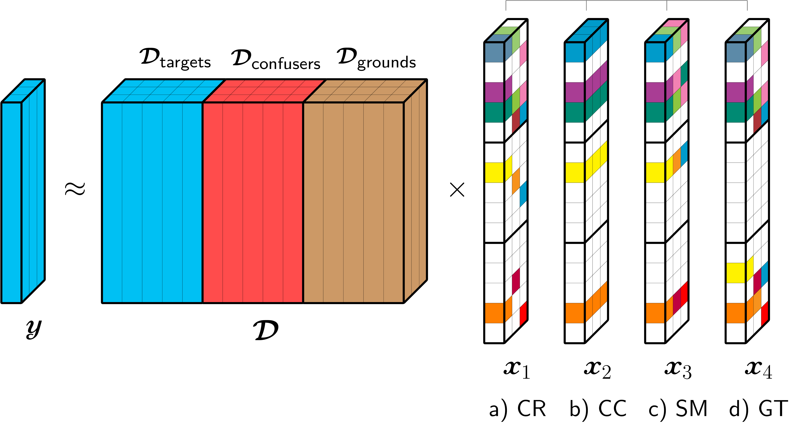

# Tensor sparsity 

**Related publication:**
1. Tiep Vu, Lam Nguyen, Calvin Le, Vishal Monga, "Tensor Sparsity for Classifying Low-Frequency Ultra-Wideband (UWB) SAR Imagery.", IEEE Radar Conference 2017. 
2. Tiep Vu, Lam Nguyen, Vishal Monga, "Classifying Multi-channel UWB SAR Imagery via Tensor Sparsity Learning Techniques.", submitted to IEEE Transactions on Aerospace and Electronic Systems.

## Different tensor sparsity constraints 
